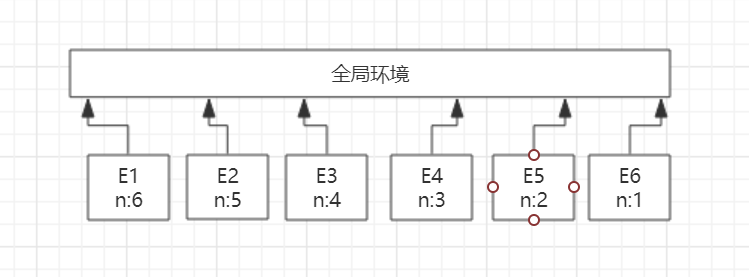
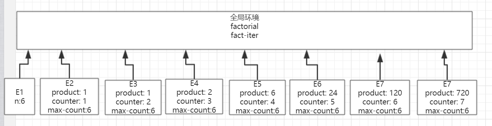

在1.2.1节中，我们用代换模型分析了两个计算阶乘的函数，递归版本如下

```js
function factorial(n) {
  if (n == 1) return 1
  else return n*factorial(n-1)
}

```

迭代版本

```js
function factorial(n) {
  return fact-iter(1, 1, n)
}

function fact-iter(product, counter, max-count) {
  if (counter > max-count) return product
  else return fact-iter(counter*product, counter+1, max-count)
}
```

请说明采用过程factorial的上述求值factorial(6)时创建的环境结构

递归版本的环境结构:



迭代版本的环境结构:


